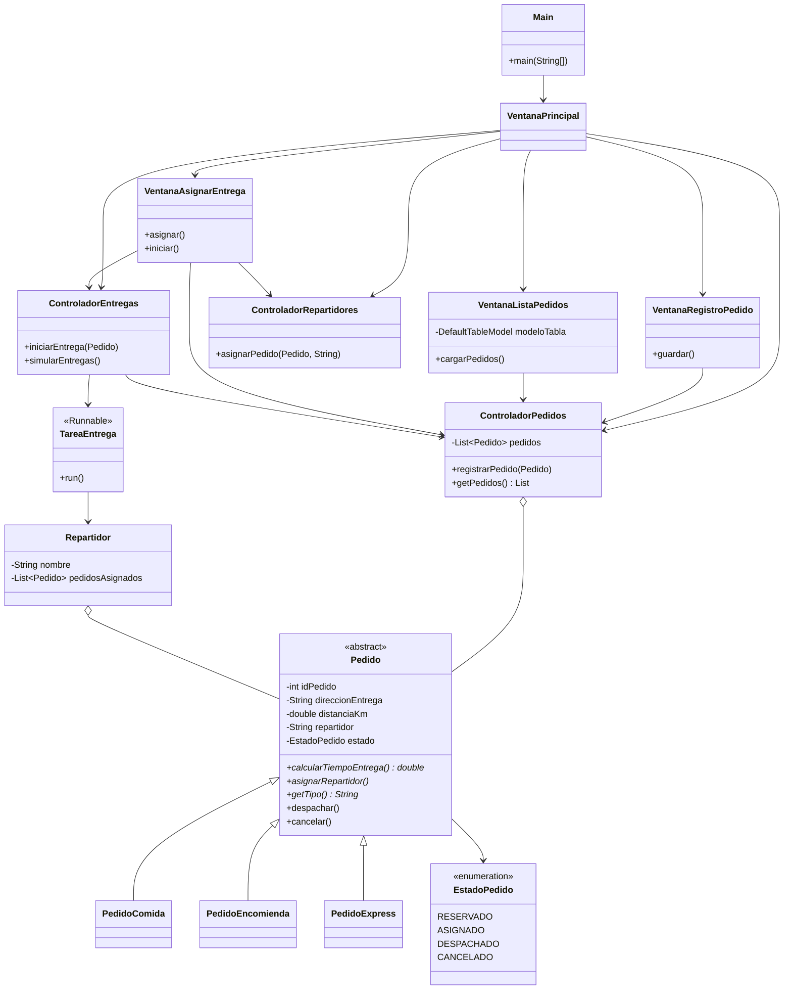

# Actividad Formativa – Semana 6
## Diseñando interfaces gráficas para aplicaciones en Java

### Proyecto: SpeedFast – Interfaz gráfica de gestión de entregas

---

## Autor del proyecto

| Campo | Detalle |
|---|---|
| **Nombre completo** | Beatriz López Casanova |
| **Asignatura** | Desarrollo Orientado a Objetos II |
| **Carrera** | Analista Programador Computacional |
| **Sede** | Virtual |

---

## Descripción general del sistema

**SpeedFast** es una empresa de reparto a domicilio. En las semanas anteriores se modelaron los pedidos, el polimorfismo y las entregas concurrentes. Esta semana el sistema pasa de la consola a una **interfaz gráfica de escritorio** con Java Swing.

Desde la ventana principal se puede:

1. **Registrar** un pedido nuevo (comida, encomienda o express).
2. **Listar** los pedidos en una tabla.
3. **Asignar un repartidor** e **iniciar la entrega**.

Los datos se guardan en una lista en memoria. **No hay conexión a base de datos** (eso corresponde a las semanas 7 y 8).

| Tipo de pedido | Fórmula de tiempo |
|---|---|
| `PedidoComida` | 15 min + 2 min por cada km |
| `PedidoEncomienda` | 20 min + 1.5 min por km (redondeado a entero) |
| `PedidoExpress` | 10 min base; si distancia > 5 km, se agregan 5 min extra |

La distancia se valida entre **0.1 km** y **100 km**. El ID no se puede repetir. Los errores se muestran con `JOptionPane` sin cerrar el programa.

---

## Estructura de paquetes y clases

La entrega de esta semana está en la carpeta **`semana 6`**, con los paquetes `modelo`, `vista`, `main` y `controlador`.

```
SpeedFast-Poliformismo/
├── src/                             → Semana 4 (código de la raíz)
├── semana 3/                        → Semana 3 (historial)
├── semana4/                         → Semana 4 (historial)
├── semana 5/                        → Semana 5 (historial)
└── semana 6/                        → Semana 6 (entrega formativa)
    ├── pom.xml
    ├── README.md
    └── src/main/java/
        ├── main/
        │   └── Main.java                    → new VentanaPrincipal()
        ├── controlador/
        │   ├── ControladorPedidos.java      → lista de pedidos en memoria
        │   ├── ControladorRepartidores.java → nombres y asignación
        │   └── ControladorEntregas.java     → hilos de TareaEntrega
        ├── tareas/
        │   └── TareaEntrega.java            → implements Runnable (hilo de entrega)
        ├── modelo/
        │   ├── Pedido.java                  → clase abstracta
        │   ├── PedidoComida.java
        │   ├── PedidoEncomienda.java
        │   ├── PedidoExpress.java
        │   ├── Repartidor.java
        │   └── EstadoPedido.java
        └── vista/
            ├── VentanaPrincipal.java
            ├── VentanaRegistroPedido.java
            ├── VentanaListaPedidos.java
            └── VentanaAsignarEntrega.java
```

---

## Diagrama de clases



### Relaciones

| Relación | Tipo | Descripción |
|---|---|---|
| `VentanaPrincipal` → otras ventanas | **Navegación** | Cada botón abre un `JFrame` distinto |
| Ventanas → controladores | **Asociación** | Cada ventana usa el controlador que le corresponde |
| `ControladorPedidos` → `Pedido` | **Agregación** | Los pedidos viven en un `ArrayList` en memoria |
| Subclases → `Pedido` | **Herencia** | Comida, encomienda y express reutilizan el modelo |
| `iniciarEntrega` | **Hilo** | Simula el viaje y luego pasa el pedido a `DESPACHADO` |

---

## Cómo contribuye el diseño a la calidad del software

- **Separación MVC:** el modelo no dibuja ventanas; la vista no guarda la lista; el controlador comparte los datos.
- **Reutilización:** se mantienen `Pedido`, las subclases y los estados de las semanas anteriores.
- **Mantenibilidad:** cada ventana tiene una responsabilidad (registrar, listar o asignar).
- **Usabilidad:** validación antes de guardar, confirmaciones con `JOptionPane` y tabla de solo lectura.

---

## Instrucciones para ejecutar el programa

### Requisitos previos

- Java JDK 17 o superior
- Maven 3.x (o abrir directamente en IntelliJ IDEA)

### Opción A – Desde IntelliJ IDEA (recomendada)

1. Abrir el repositorio como proyecto Maven en IntelliJ IDEA.
2. Si no aparece Run, clic derecho en `semana 6/pom.xml` → **Add as Maven Project**.
3. Navegar a `semana 6/src/main/java/main/Main.java`.
4. Hacer clic derecho → **Run 'Main.main()'**.

### Opción B – Desde terminal con Maven

```bash
cd "semana 6"
mvn compile
mvn exec:java -Dexec.mainClass="main.Main"
```

### Opción C – Desde terminal (sin Maven)

```bash
cd "semana 6"
mkdir -p out
javac -encoding UTF-8 -d out $(find src/main/java -name "*.java")
java -cp out main.Main
```

---

## Flujo esperado en la interfaz

Al iniciar se abre **VentanaPrincipal** con cuatro botones.

| Botón | Ventana | Qué hace |
|---|---|---|
| Registrar pedido | `VentanaRegistroPedido` | Pide ID, dirección, distancia y tipo (`JComboBox`). En encomienda también pide peso y si es frágil. **Guardar** valida, crea el pedido y muestra un `JOptionPane` de confirmación. |
| Listar pedidos | `VentanaListaPedidos` | Muestra una `JTable` con `DefaultTableModel`. Se actualiza sola al registrar o despachar, y también con **Actualizar**. |
| Asignar repartidor / Iniciar entrega | `VentanaAsignarEntrega` | Se elige un pedido y un repartidor. **Asignar** deja el estado en `ASIGNADO`. **Iniciar entrega** lanza un hilo `TareaEntrega`. |
| Simular entregas | Área de actividad | Un hilo por repartidor, en paralelo. Los mensajes aparecen en el `JTextArea`. |

Hay tres pedidos de ejemplo al partir: `#101` comida, `#102` encomienda y `#103` express.

---

## Buenas prácticas aplicadas

- Paquetes `modelo`, `vista`, `main` y `controlador`.
- `Main` arranca con `new VentanaPrincipal()`.
- Layouts `BorderLayout` y `GridLayout`.
- Formulario con `JTextField`, `JComboBox`, `JCheckBox` y `JButton`.
- Listado con `JTable` + `DefaultTableModel` de solo lectura (`isCellEditable` = false).
- Validación de campos vacíos, números, ID repetido, distancia y peso.
- Mensajes con `JOptionPane` (información, advertencia, error y confirmación).
- Un controlador por tipo de dato: `ControladorPedidos`, `ControladorRepartidores` y `ControladorEntregas`.
- Paquete `tareas`: `TareaEntrega` implementa `Runnable` y corre en un `Thread`.
- `Repartidor` queda en `modelo` (nombre y pedidos); no ejecuta el hilo.
- `TareaEntrega` escribe en el `JTextArea` desde el hilo.

---

**Repositorio GitHub:** https://github.com/Be-ri-lo/SpeedFast-Poliformismo

**Fecha de entrega:** Semana 6 – Septiembre 2026

© Duoc UC | Escuela de Informática y Telecomunicaciones
