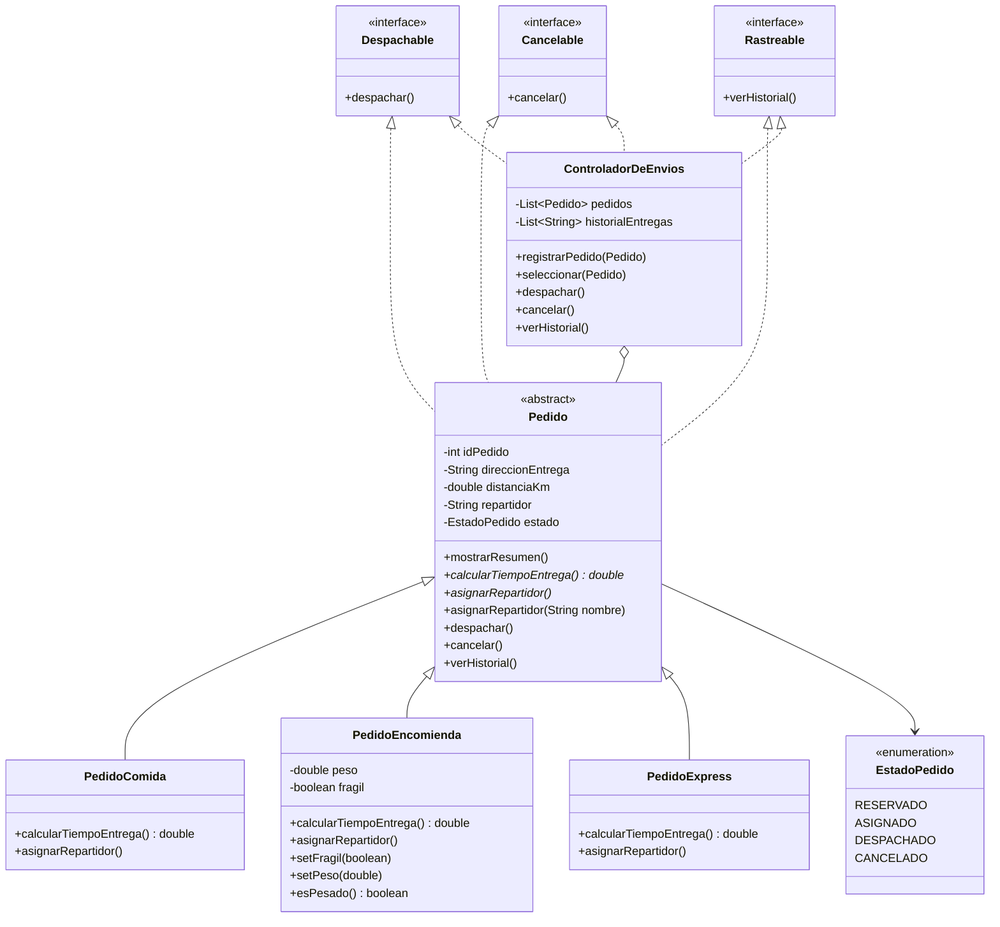

# Actividad Sumativa – Semana 3
## Diseñando un sistema orientado a objetos con clases abstractas, polimorfismo e interfaces

### Proyecto: SpeedFast – Sistema integral de entregas

---

## Autor del proyecto

| Campo | Detalle |
|---|---|
| **Nombre completo** | Beatriz López Casanova |
| **Asignatura** | Desarrollo Orientado a Objetos II |
| **Carrera** | Analista Programador Computacional |
| **Sede** | Virtual |

---

## Descripción general del sistema

**SpeedFast** es una empresa de reparto a domicilio que gestiona comida, encomiendas y compras express. La carpeta `src/` conserva la **semana 2** (clase abstracta y cálculo de tiempo). La entrega actual está en **`semana 3`**: se suman asignación de repartidor, interfaces, despacho, cancelación e historial.

| Tipo de pedido | Fórmula de tiempo | Extra |
|---|---|---|
| `PedidoComida` | 15 min + 2 min por cada km | — |
| `PedidoEncomienda` | 20 min + 1.5 min por km (redondeado) | `peso`, `fragil`; pesado si peso > 20 kg |
| `PedidoExpress` | 10 min; +5 min si distancia > 5 km | — |

La distancia se valida entre **0.1 km** y **100 km**. Los errores se controlan en `Main` con `try-catch`.

---

## Estructura del repositorio

```
SpeedFast-Poliformismo/
├── src/main/java/org/speedFast/     → Semana 2
│   ├── app/Main.java
│   └── model/
│       ├── Pedido.java
│       ├── PedidoComida.java
│       ├── PedidoEncomienda.java
│       └── PedidoExpress.java
└── semana 3/                        → Semana 3 (entrega)
    ├── pom.xml
    ├── README.md
    └── src/main/java/org/speedFast/
        ├── app/Main.java
        ├── interfaces/
        │   ├── Despachable.java
        │   ├── Cancelable.java
        │   └── Rastreable.java
        ├── model/
        │   ├── Pedido.java
        │   ├── PedidoComida.java
        │   ├── PedidoEncomienda.java
        │   └── PedidoExpress.java
        ├── service/
        │   └── ControladorDeEnvios.java
        └── util/
            └── EstadoPedido.java
```

### Paquetes de la semana 3

```
semana 3/src/main/java/org/speedFast/
├── interfaces/   Despachable, Cancelable, Rastreable
├── model/        Pedido (abstracta) y las tres hijas
├── service/      ControladorDeEnvios (historial ArrayList)
├── util/         EstadoPedido
└── app/          Main (simulación)
```

---

## Diagrama de clases (semana 3)



### Relaciones

| Relación | Tipo | Descripción |
|---|---|---|
| `Pedido` | **Clase abstracta** | Atributos comunes, `mostrarResumen()`, `calcularTiempoEntrega()` y `asignarRepartidor()` abstractos |
| Subclases → `Pedido` | **Herencia** | Reutilizan constructor y resumen; cada una define tiempo y asignación |
| `asignarRepartidor()` | **Sobrescritura** | Cada hija asigna su repartidor automático |
| `asignarRepartidor(String)` | **Sobrecarga** | Asignación manual con un nombre |
| Interfaces | **Desacoplamiento** | `Despachable`, `Cancelable` y `Rastreable` en `Pedido` y en `ControladorDeEnvios` |
| `ControladorDeEnvios` | **Coordinación** | Despacha, cancela y guarda el historial en un `ArrayList` |
| `PedidoEncomienda` | **Atributos propios** | `peso` y `fragil`; `esPesado()` si peso > 20 kg |

---

## Cómo contribuye el diseño a la calidad del software

- **Escalabilidad:** un nuevo tipo de pedido es otra subclase de `Pedido`, sin reescribir `Main` ni el controlador.
- **Reutilización:** resumen, validación de distancia, despacho y cancelación viven en la clase abstracta.
- **Mantenibilidad:** `Main` puede trabajar con `Despachable` o `Rastreable` sin conocer la clase concreta.

---

## Instrucciones para ejecutar el programa

### Requisitos previos

- Java JDK 17 o superior (probado con JDK 26)
- Maven 3.x, o abrir el proyecto en IntelliJ IDEA

### Semana 3 (entrega actual)

En IntelliJ: `semana 3/src/main/java/org/speedFast/app/Main.java` → Run.

```bash
mkdir -p out-s3
javac -encoding UTF-8 -d out-s3 $(find "semana 3/src/main/java" -name "*.java")
java -cp out-s3 org.speedFast.app.Main
```

### Semana 2 (carpeta `src/`)

En IntelliJ: `src/main/java/org/speedFast/app/Main.java` → Run.

```bash
mvn compile
java -cp target/classes org.speedFast.app.Main
```

---

## Salida esperada por consola (semana 3)

```
PedidoEncomienda #002
Dirección: Av. Independencia 123
Distancia: 6.0 km
Repartidor asignado: Daniela Tapia
Estado: Despachado
Tiempo estimado: 29.0 minutos
Frágil: Sí
Peso: 22.0 kg (pesado)
Pedido despachado correctamente.

PedidoComida #001
Dirección: Av. Italia 456
Distancia: 2.7 km
Repartidor asignado: Luis Díaz
Estado: Despachado
Tiempo estimado: 20.4 minutos
Pedido despachado correctamente.

Cancelando Pedido Express #003...
→ Pedido cancelado exitosamente.

PedidoExpress #003
Dirección: Av. Apoquindo 1500
Distancia: 15.0 km
Repartidor asignado: Carlos Soto
Estado: Cancelado
Tiempo estimado: 15.0 minutos

Historial:
- PedidoEncomienda #002 – entregado por Daniela Tapia
- PedidoComida #001 – entregado por Luis Díaz
```

---

## Buenas prácticas aplicadas

- Clase abstracta `Pedido` con atributos encapsulados y constructor completo.
- `mostrarResumen()` reutilizado por las subclases.
- `calcularTiempoEntrega()` abstracto, implementado en cada hija.
- Sobrescritura y sobrecarga de `asignarRepartidor`.
- Interfaces `Despachable`, `Cancelable` y `Rastreable`.
- Historial en `ArrayList` dentro de `ControladorDeEnvios`.
- Validación de distancia, peso y estados inválidos.
- Separación en paquetes `interfaces`, `model`, `service`, `util` y `app`.

---

**Repositorio GitHub:** https://github.com/Be-ri-lo/SpeedFast-Poliformismo

**Fecha de entrega:** Semana 3 – Agosto 2026

© Duoc UC | Escuela de Informática y Telecomunicaciones
