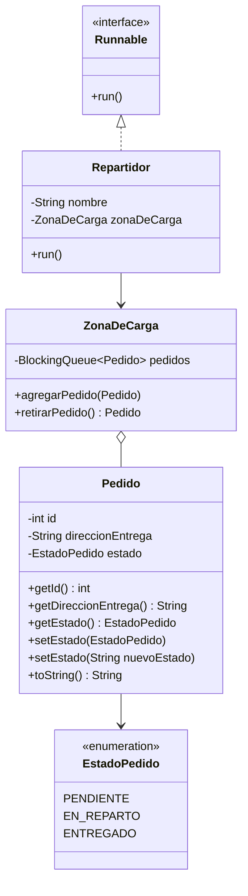

# Actividad Sumativa – Semana 5
## Sincronizando procesos en sistemas concurrentes

### Proyecto: SpeedFast – Coordinación de entregas

---

## Autor del proyecto

| Campo | Detalle |
|---|---|
| **Nombre completo** | Beatriz López Casanova |
| **Asignatura** | Desarrollo Orientado a Objetos II |
| **Carrera** | Analista Programador Computacional |
| **Sede** | Virtual |

---

## Descripción general del sistema

**SpeedFast** es una empresa de reparto a domicilio. Durante el despacho, varios repartidores llegan **al mismo tiempo** a la zona de carga y podrían retirar el mismo pedido.

Esta semana el recurso compartido es la **zona de carga**. Las encomiendas se guardan en un `BlockingQueue` y se retiran **de uno en uno**, con métodos `synchronized`, para que cada pedido lo entregue un solo repartidor.

El ciclo de cada encomienda es:

`PENDIENTE` → `EN_REPARTO` → `ENTREGADO`

| Clase | Rol |
|---|---|
| `Pedido` | Encomienda con id, dirección y estado |
| `EstadoPedido` | `PENDIENTE`, `EN_REPARTO`, `ENTREGADO` |
| `ZonaDeCarga` | Recurso compartido (`BlockingQueue` + `synchronized`) |
| `Repartidor` | Hilo que retira, entrega y marca el pedido |
| `Main` | Crea 5 pedidos y lanza 3 repartidores |

---

## Estructura de paquetes y clases

La entrega de esta semana está en la carpeta **`semana 5`**.

```
SpeedFast-Poliformismo/
├── src/                             → Semana 4 (código de la raíz)
├── semana 3/                        → Semana 3 (historial)
├── semana4/                         → Semana 4 (historial)
└── semana 5/                        → Semana 5 (entrega sumativa)
    ├── pom.xml
    ├── README.md
    └── src/main/java/org/speedFast/
        ├── model/
        │   ├── Pedido.java          → id, direccionEntrega, estado
        │   ├── ZonaDeCarga.java     → BlockingQueue + synchronized
        │   └── Repartidor.java      → implements Runnable
        ├── util/
        │   └── EstadoPedido.java    → PENDIENTE, EN_REPARTO, ENTREGADO
        └── app/
            └── Main.java            → ExecutorService + 3 hilos
```

---

## Diagrama de clases



### Relaciones

| Relación | Tipo | Descripción |
|---|---|---|
| `ZonaDeCarga` → `Pedido` | **Agregación** | La zona guarda los pedidos pendientes en un `BlockingQueue` |
| `Repartidor` → `ZonaDeCarga` | **Asociación** | Los 3 repartidores usan la **misma** instancia |
| `Repartidor` | **Hilo** | Implementa `Runnable`; `run()` retira y entrega |
| `Runnable` | **Interfaz de Java** | `java.lang.Runnable`; no se declara en el proyecto |
| `setEstado(String)` | **Sobrecarga** | Actualiza el estado desde un texto (`EN_REPARTO`, `ENTREGADO`) |
| `synchronized` | **Sincronización** | Evita el retiro doble del mismo pedido |
| `Thread.sleep()` | **Pausa** | Simula el viaje con un tiempo aleatorio (1 a 3 segundos) |
| `ExecutorService` | **Pool de hilos** | En `Main` lanza a Camila, Luis y Daniela |

---

## Cómo contribuye el diseño a la calidad del software

- **Integridad de datos:** `agregarPedido` y `retirarPedido` son `synchronized`, así que dos hilos no pueden sacar el mismo pedido.
- **Escalabilidad:** un nuevo repartidor es otra instancia de `Repartidor`; el pool puede crecer sin cambiar `ZonaDeCarga`.
- **Reutilización:** la zona de carga es un solo recurso compartido; todos los hilos trabajan sobre la misma cola.
- **Mantenibilidad:** cada clase tiene una responsabilidad: pedido, zona o hilo de entrega. `Main` solo arma la simulación y espera el cierre.

---

## Instrucciones para ejecutar el programa

### Requisitos previos

- Java JDK 17 o superior (el proyecto fue compilado y probado con JDK 26)
- Maven 3.x (o abrir directamente en IntelliJ IDEA)

### Opción A – Desde IntelliJ IDEA (recomendada)

1. Abrir el repositorio como proyecto Maven en IntelliJ IDEA.
2. Si no aparece Run, clic derecho en `semana 5/pom.xml` → **Add as Maven Project**.
3. Navegar a `semana 5/src/main/java/org/speedFast/app/Main.java`.
4. Hacer clic derecho → **Run 'Main.main()'**.

### Opción B – Desde terminal con Maven

```bash
cd "semana 5"
mvn compile
mvn exec:java -Dexec.mainClass="org.speedFast.app.Main"
```

### Opción C – Desde terminal (sin Maven)

```bash
cd "semana 5"
mkdir -p out
javac -encoding UTF-8 -d out $(find src/main/java -name "*.java")
java -cp out org.speedFast.app.Main
```

---

## Salida esperada por consola

El orden de las líneas de Camila, Luis y Daniela **cambia en cada ejecución** porque los hilos corren a la vez. Lo que no cambia: cada pedido se retira una sola vez y termina en `ENTREGADO`.

```
[Zona de carga inicializada]
Pedido #1 agregado. Destino: Santiago Centro
Pedido #2 agregado. Destino: Providencia
Pedido #3 agregado. Destino: Ñuñoa
Pedido #4 agregado. Destino: Recoleta
Pedido #5 agregado. Destino: Las Condes
[Repartidor - Camila] Retirando pedido #1...
[Repartidor - Camila] Estado: EN_REPARTO
[Repartidor - Camila] Entregando pedido #1...
[Repartidor - Luis] Retirando pedido #2...
[Repartidor - Luis] Estado: EN_REPARTO
[Repartidor - Luis] Entregando pedido #2...
[Repartidor - Daniela] Retirando pedido #3...
[Repartidor - Daniela] Estado: EN_REPARTO
[Repartidor - Daniela] Entregando pedido #3...
...
[Zona de carga vacía]
[Repartidor - Camila] Estado: ENTREGADO
...
Todos los pedidos han sido entregados correctamente.
```

| Repartidor | Qué hace |
|---|---|
| Camila, Luis y Daniela | Compiten por la zona de carga; cada uno toma un pedido distinto |

---

## Buenas prácticas aplicadas

- `ZonaDeCarga` guarda los pedidos en un `BlockingQueue<Pedido>` (recurso compartido).
- `agregarPedido` y `retirarPedido` son `synchronized` para evitar condiciones de carrera.
- Solo se agregan pedidos con estado `PENDIENTE`.
- `retirarPedido()` usa `poll()`: saca el primer pedido o devuelve `null` si la zona está vacía.
- `Pedido` actualiza el estado con `setEstado(String nuevoEstado)`, como piden las instrucciones.
- `Repartidor` implementa `Runnable` y simula la entrega con `Thread.sleep()`.
- `ExecutorService` lanza 3 repartidores; el cierre se hace con `shutdown()` y `awaitTermination`.
- Manejo de `InterruptedException` e `IllegalArgumentException`.
- Separación de responsabilidades en paquetes `model`, `util` y `app`.

---

**Repositorio GitHub:** https://github.com/Be-ri-lo/SpeedFast-Poliformismo

**Fecha de entrega:** Semana 5 – Septiembre 2026

© Duoc UC | Escuela de Informática y Telecomunicaciones
