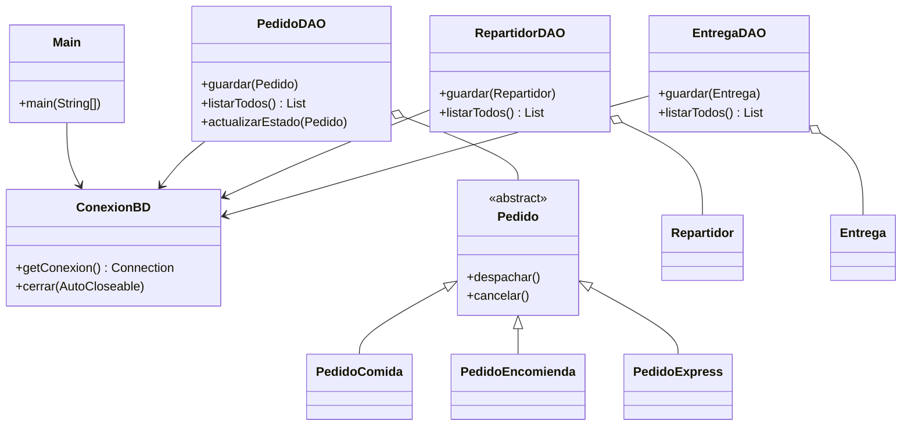

# Actividad Formativa – Semana 7
## Conectando aplicaciones Java con bases de datos mediante JDBC

### Proyecto: SpeedFast – Persistencia de pedidos y entregas

---

## Autor del proyecto

| Campo | Detalle |
|---|---|
| **Nombre completo** | Beatriz López Casanova |
| **Asignatura** | Desarrollo Orientado a Objetos II |
| **Carrera** | Analista Programador Computacional |
| **Sede** | Virtual |

---

## Descripción general del sistema

**SpeedFast** es una empresa de reparto a domicilio. Esta semana la interfaz de la semana 6 se conecta a **MySQL** con JDBC: los pedidos, repartidores y entregas se guardan y consultan en `speedfast_db`.

Desde la ventana principal se puede:

1. **Registrar** un pedido (queda en la tabla `pedido`).
2. **Registrar** un repartidor (tabla `repartidor`).
3. **Listar** pedidos y entregas en `JTable`.
4. **Asignar** un repartidor e **iniciar** la entrega (tabla `entrega` + cambio de estado).

La conexión la abre `conexion.ConexionBD` con `DriverManager`. Cada tabla tiene un DAO. **No hay** `DELETE` de filas: cancelar solo cambia el estado.

---

## Qué hay que recordar de esta semana

1. **MySQL** guarda las tablas. **Java** se conecta con **JDBC**.
2. `ConexionBD` solo abre y cierra el canal (`getConexion()`).
3. Cada tabla tiene un **DAO**: `PreparedStatement`, `ResultSet`, `try-catch-finally`.
4. La **GUI** no escribe SQL: llama al controlador y el controlador llama al DAO.
5. Registrar un pedido **no** crea una entrega. La entrega aparece al **asignar** o **iniciar**.

---

## Modelo de base de datos

Base: `speedfast_db` (script en `semana7/script.sql`).

| Tabla | Columnas | Para qué |
|---|---|---|
| `repartidor` | id, nombre | Quién entrega |
| `pedido` | id, direccion, tipo, estado, distancia_km, peso, fragil | Qué se entrega |
| `entrega` | id, id_pedido, id_repartidor, fecha, hora | Une pedido + repartidor (FK) |

tipo: `COMIDA` \| `ENCOMIENDA` \| `EXPRESS`  
estado: `PENDIENTE` \| `EN_REPARTO` \| `ENTREGADO`

---

## Estructura de paquetes y clases

La entrega de esta semana está en la carpeta **`semana7`**.

```
SpeedFast-Poliformismo/
├── src/                             → Semana 4 (código de la raíz)
├── semana 3/                        → Semana 3 (historial)
├── semana4/                         → Semana 4 (historial)
├── semana 5/                        → Semana 5 (historial)
├── semana 6/                        → Semana 6 (interfaz Swing)
└── semana7/                         → Semana 7 (JDBC + MySQL)
    ├── pom.xml                      → mysql-connector-j 9.4.0
    ├── script.sql                   → CREATE DATABASE / tablas / FK
    ├── README.md
    └── src/main/java/
        ├── app/Main.java            → prueba getConexion() y abre la GUI
        ├── conexion/ConexionBD.java → DriverManager hacia speedfast_db
        ├── dao/
        │   ├── PedidoDAO.java
        │   ├── RepartidorDAO.java
        │   └── EntregaDAO.java
        ├── controlador/
        ├── modelo/
        ├── tareas/
        └── vista/
```

---

## Diagrama de clases


```mermaid
classDiagram
    class Main {
        +main(String[])
    }
    class ConexionBD {
        +getConexion() Connection
        +cerrar(AutoCloseable)
    }
    class PedidoDAO {
        +guardar(Pedido)
        +listarTodos() List
        +actualizarEstado(Pedido)
    }
    class RepartidorDAO {
        +guardar(Repartidor)
        +listarTodos() List
    }
    class EntregaDAO {
        +guardar(Entrega)
        +listarTodos() List
    }
    class Pedido {
        <<abstract>>
        +despachar()
        +cancelar()
    }
    class Repartidor
    class Entrega

    Main --> ConexionBD
    PedidoDAO --> ConexionBD
    RepartidorDAO --> ConexionBD
    EntregaDAO --> ConexionBD
    PedidoDAO o-- Pedido
    RepartidorDAO o-- Repartidor
    EntregaDAO o-- Entrega
    Pedido <|-- PedidoComida
    Pedido <|-- PedidoEncomienda
    Pedido <|-- PedidoExpress
```

### Relaciones

| Relación | Tipo | Descripción |
|---|---|---|
| Vista → Controlador → DAO → MySQL | **Arquitectura** | La ventana no ejecuta SQL |
| `entrega` → `pedido` | **FK** | `id_pedido` |
| `entrega` → `repartidor` | **FK** | `id_repartidor` |
| Un repartidor → muchas entregas | **1:N** | Un mismo repartidor puede tener varias filas en entrega |

---

## Cómo contribuye el diseño a la calidad del software

- **Separación:** el modelo no habla con JDBC; el DAO no dibuja ventanas.
- **Persistencia:** al cerrar el programa los datos siguen en MySQL.
- **Seguridad:** `PreparedStatement` con `?` (consultas parametrizadas).
- **Mantenibilidad:** un DAO por tabla.

---

## Instrucciones para ejecutar el programa

### Requisitos previos

- Java JDK 17 o superior
- Maven 3.x (o abrir en IntelliJ IDEA)
- MySQL Server en `localhost:3306` con la base `speedfast_db`

Usuario JDBC: `root` / contraseña: `1234`.

### Opción A – Desde IntelliJ IDEA (recomendada)

1. Abrir el repositorio como proyecto Maven.
2. Clic derecho en `semana7/pom.xml` → **Add as Maven Project**.
3. Ejecutar `semana7/src/main/java/app/Main.java`.
4. En consola debe aparecer: `Conexión a speedfast_db correcta.`

### Opción B – Desde terminal con Maven

```bash
cd semana7
mvn compile
mvn exec:java -Dexec.mainClass="app.Main"
```

---

## Flujo esperado en la interfaz

| Botón | Qué hace en MySQL |
|---|---|
| Registrar pedido | `INSERT INTO pedido` |
| Registrar repartidor | `INSERT INTO repartidor` |
| Listar pedidos | `SELECT` → `JTable` |
| Listar entregas | `SELECT` con JOIN |
| Asignar / Iniciar entrega | `INSERT INTO entrega` + `UPDATE pedido.estado` |

---

## Buenas prácticas aplicadas

- Maven con `mysql-connector-j` 9.4.0.
- Paquetes `app`, `conexion`, `dao`, `controlador`, `modelo`, `vista`.
- `ConexionBD.getConexion()` con `DriverManager`.
- `try-catch-finally` al cerrar Connection, PreparedStatement y ResultSet.
- Formularios que validan y confirman con `JOptionPane`.
- Listados con `JTable` + `DefaultTableModel` de solo lectura.

---

**Repositorio GitHub:** https://github.com/Be-ri-lo/SpeedFast-Poliformismo

**Fecha de entrega:** Semana 7 – Septiembre 2026

© Duoc UC | Escuela de Informática y Telecomunicaciones
