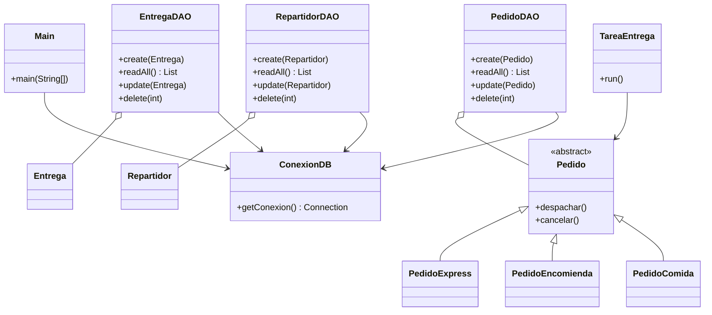

# Actividad Formativa – Semana 8
## Persistiendo datos con objetos y base de datos

### Proyecto: SpeedFast – CRUD de pedidos, repartidores y entregas

---

## Autor del proyecto

| Campo | Detalle |
|---|---|
| **Nombre completo** | Beatriz López Casanova |
| **Asignatura** | Desarrollo Orientado a Objetos II |
| **Carrera** | Analista Programador Computacional |
| **Sede** | Virtual |

---

## Descripción general del sistema

**SpeedFast** es una empresa de reparto a domicilio. Esta semana se completa el ciclo: la interfaz Swing gestiona **repartidores**, **pedidos** y **entregas** con CRUD persistente en MySQL.

Desde la ventana principal se puede:

1. **Gestionar repartidores**: registrar, listar, editar y eliminar.
2. **Gestionar pedidos**: registrar, listar con filtros, editar y eliminar.
3. **Gestionar entregas**: asignar un pedido a un repartidor, filtrar, editar y eliminar.
4. **Simular** el viaje de las entregas asignadas.

La conexión la abre `conexion.ConexionDB` con `DriverManager`. Cada tabla tiene un DAO con `create`, `readAll`, `update` y `delete`. Registrar un pedido **no** crea una entrega: la entrega se inserta al **Asignar**.

---

## Qué hay que recordar de esta semana

1. **MySQL** guarda las tablas. **Java** se conecta con **JDBC**.
2. `ConexionDB` solo abre el canal (`getConexion()`). Usuario y clave se leen de `conexion.properties`.
3. Cada tabla tiene un **DAO**: `PreparedStatement`, `ResultSet`, `try-with-resources`.
4. La **GUI** no escribe SQL: llama al controlador y el controlador llama al DAO.
5. Se valida el formulario **antes** de tocar MySQL. Si falla SQL, el error sale con `JOptionPane`.
6. Registrar un pedido **no** crea una entrega. La entrega aparece al **Asignar**.

---

## Modelo de base de datos

Base: `speedfast_db` (script en `semana8/script.sql`).

| Tabla | Columnas | Para qué |
|---|---|---|
| `repartidores` | id, nombre | Quién entrega |
| `pedidos` | id, direccion, tipo, estado, distancia_km, peso, fragil | Qué se entrega |
| `entregas` | id, id_pedido, id_repartidor, fecha, hora | Une pedido + repartidor (FK) |

tipo: `COMIDA` \| `ENCOMIENDA` \| `EXPRESS`  
estado: `PENDIENTE` \| `EN_REPARTO` \| `ENTREGADO`

De la pauta: `repartidores`, `pedidos` (id, dirección, tipo, estado) y `entregas` con FK.  
**Extra** (del modelo SpeedFast): `distancia_km`, `peso` y `fragil` en `pedidos`.

La guía nombra un `ClienteDAO`. En este proyecto no hay clientes: el DAO equivalente es `RepartidorDAO`.

---

## Estructura de paquetes y clases

La entrega de esta semana está en la carpeta **`semana8`**.

```
SpeedFast-Poliformismo/
├── src/                             → Semana 4 (código de la raíz)
├── semana 3/                        → Semana 3 (historial)
├── semana4/                         → Semana 4 (historial)
├── semana 5/                        → Semana 5 (historial)
├── semana 6/                        → Semana 6 (interfaz Swing)
├── semana7/                         → Semana 7 (JDBC, sin DELETE)
└── semana8/                         → Semana 8 (CRUD + JDBC)
    ├── pom.xml                      → mysql-connector-j 9.4.0
    ├── script.sql                   → CREATE DATABASE / tablas / FK
    ├── README.md
    ├── conexion.properties.ejemplo  → plantilla (la clave no se sube)
    ├── lib/
    │   └── mysql-connector-j-9.4.0.jar
    └── src/main/java/
        ├── app/Main.java            → prueba getConexion() y abre la GUI
        ├── conexion/ConexionDB.java → DriverManager hacia speedfast_db
        ├── dao/
        │   ├── PedidoDAO.java
        │   ├── RepartidorDAO.java
        │   └── EntregaDAO.java
        ├── controlador/
        ├── modelo/
        ├── tareas/
        └── vista/
```

---

## Diagrama de clases


```mermaid
classDiagram
    class Main {
        +main(String[])
    }
    class ConexionDB {
        +getConexion() Connection
    }
    class PedidoDAO {
        +create(Pedido)
        +readAll() List
        +update(Pedido)
        +delete(int)
    }
    class RepartidorDAO {
        +create(Repartidor)
        +readAll() List
        +update(Repartidor)
        +delete(int)
    }
    class EntregaDAO {
        +create(Entrega)
        +readAll() List
        +update(Entrega)
        +delete(int)
    }
    class Pedido {
        <<abstract>>
        +despachar()
        +cancelar()
    }
    class Repartidor
    class Entrega
    class TareaEntrega {
        +run()
    }

    Main --> ConexionDB
    PedidoDAO --> ConexionDB
    RepartidorDAO --> ConexionDB
    EntregaDAO --> ConexionDB
    PedidoDAO o-- Pedido
    RepartidorDAO o-- Repartidor
    EntregaDAO o-- Entrega
    Pedido <|-- PedidoComida
    Pedido <|-- PedidoEncomienda
    Pedido <|-- PedidoExpress
    TareaEntrega --> Pedido
```

### Relaciones

| Relación | Tipo | Descripción |
|---|---|---|
| Vista → Controlador → DAO → MySQL | **Arquitectura** | La ventana no ejecuta SQL |
| `entregas` → `pedidos` | **FK** | `id_pedido` |
| `entregas` → `repartidores` | **FK** | `id_repartidor` |
| Un repartidor → muchas entregas | **1:N** | Un mismo repartidor puede tener varias filas en entregas |

---

## Cómo contribuye el diseño a la calidad del software

- **Separación:** el modelo no habla con JDBC; el DAO no dibuja ventanas.
- **Persistencia:** al cerrar el programa los datos siguen en MySQL.
- **Seguridad:** `PreparedStatement` con `?` (consultas parametrizadas). La clave JDBC no se publica en GitHub.
- **Mantenibilidad:** un DAO por tabla, con `create`, `readAll`, `update` y `delete`.
- **Validación:** se revisan los campos en la interfaz antes de llamar al DAO.

---

## Instrucciones para ejecutar el programa

### Requisitos previos

- Java JDK 17 o superior
- Maven 3.x (o abrir en IntelliJ IDEA)
- MySQL Server en `localhost:3306` con la base `speedfast_db`
- Driver `mysql-connector-j` 9.4.0 (en `semana8/lib/` y también en el `pom.xml`)

La clave de MySQL **no se sube a GitHub**. Copiar `semana8/conexion.properties.ejemplo` a `semana8/conexion.properties` y completar `db.clave`. Usuario y clave se entregan al docente en el informe o en el mensaje de la plataforma.

### Opción A – Desde IntelliJ IDEA (recomendada)

1. Abrir el repositorio como proyecto Maven.
2. Clic derecho en `semana8/pom.xml` → **Add as Maven Project**.
3. Ejecutar `semana8/src/main/java/app/Main.java`.
4. En consola debe aparecer: `Conexión a speedfast_db correcta.`

### Opción B – Desde terminal con Maven

```bash
cd semana8
mvn compile
mvn exec:java -Dexec.mainClass="app.Main"
```

---

## Flujo esperado en la interfaz

| Botón | Qué hace en MySQL |
|---|---|
| Nuevo / Guardar (repartidor o pedido) | `INSERT` (`create`) |
| Recargar / Filtrar | `SELECT` (`readAll`) |
| Editar | `UPDATE` (`update`) |
| Eliminar | `DELETE` (`delete`) |
| Asignar entrega | `INSERT INTO entregas` + `UPDATE pedidos.estado` |
| Simular entregas | `UPDATE` estado a `ENTREGADO` (un hilo por repartidor) |

Los combos de entrega muestran `id - nombre` o `id - dirección` y se refrescan al crear, editar o eliminar.

Si se intenta borrar un pedido o un repartidor que todavía tiene entregas, el mensaje es: *tiene entregas asociadas*.

---

## Interfaz gráfica (Swing)

Las ventanas son `JFrame` armados en código (no se usan archivos `.form`).

| Componente | Dónde se usa |
|---|---|
| `JFrame` / `JPanel` | Menú y cada pantalla de gestión |
| `JTable` | Listados de repartidores, pedidos y entregas |
| `JTextField` | Nombre, dirección, km, peso, fecha, hora |
| `JComboBox` | Tipo, estado, pedido, repartidor |
| `JButton` | Nuevo, Editar, Eliminar, Filtrar, Asignar, Recargar |
| `JOptionPane` | Éxito, error y confirmación |

A la derecha de **Gestionar entregas** hay una cola del día: primero los repartidores libres y, si ya tienen carga, el que lleva menos pedidos hoy.

---

## Buenas prácticas aplicadas

- Maven con `mysql-connector-j` 9.4.0 (el `.jar` también está en `semana8/lib/`).
- Paquetes `app`, `conexion`, `dao`, `controlador`, `modelo`, `vista`, `tareas`.
- `ConexionDB.getConexion()` con `DriverManager`.
- `try-with-resources` al cerrar Connection, PreparedStatement y ResultSet.
- Formularios que validan y confirman con `JOptionPane`.
- Listados con `JTable` + `DefaultTableModel`.
- Combos de Pedido y Repartidor cargados desde MySQL (`id - texto`).

---

## Pauta (criterios)

1. Base `speedfast_db` y tablas con relaciones/FK (`repartidores`, `pedidos`, `entregas`).
2. Clase `ConexionDB` y manejo de excepciones.
3. DAO por entidad: `create`, `readAll`, `update`, `delete` con `PreparedStatement`.
4. Interfaz Swing conectada a los DAO (JTable, combos, validaciones, `JOptionPane`).
5. Proyecto en GitHub y comprimido, compilando sin errores.

---

**Repositorio GitHub:** https://github.com/Be-ri-lo/SpeedFast-Poliformismo

**Fecha de entrega:** Semana 8 – Octubre 2026

© Duoc UC | Escuela de Informática y Telecomunicaciones
