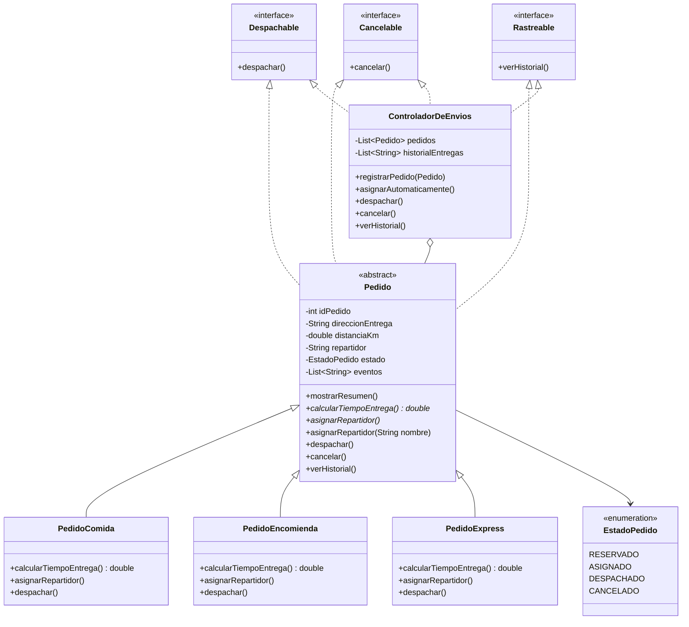

# Actividad Sumativa – Semana 3
## Diseñando un sistema orientado a objetos con clases abstractas, polimorfismo e interfaces

### Proyecto: SpeedFast – Sistema integral de entregas

---

## Autor del proyecto

| Campo | Detalle |
|---|---|
| **Nombre completo** | Beatriz López Casanova |
| **Asignatura** | Desarrollo Orientado a Objetos II |
| **Carrera** | Analista Programador Computacional |
| **Sede** | Virtual |

---

## Descripción general del sistema

**SpeedFast** es una empresa de reparto a domicilio que gestiona de forma integral tres tipos de servicio: comida, encomiendas y compras express. Cada tipo de pedido tiene reglas propias para **asignar repartidor** y **calcular el tiempo de entrega**.

Esta versión incorpora de manera conjunta:

- Una **clase abstracta** `Pedido` con atributos comunes, `mostrarResumen()` y el método abstracto `calcularTiempoEntrega()`.
- **Polimorfismo** por sobrescritura (`asignarRepartidor()`) y por sobrecarga (`asignarRepartidor(String nombre)`).
- **Interfaces** `Despachable`, `Cancelable` y `Rastreable` para desacoplar las operaciones funcionales.
- Un **controlador** `ControladorDeEnvios` que coordina reserva, despacho, cancelación e historial.

| Tipo de pedido | Fórmula de tiempo | Asignación automática |
|---|---|---|
| `PedidoComida` | 15 min + 2 min por cada km | Motociclista de alimentos |
| `PedidoEncomienda` | 20 min + 1.5 min por km (redondeado) | Furgón de encomiendas |
| `PedidoExpress` | 10 min base; +5 min si distancia > 5 km | Bici eléctrica express |

La distancia se valida entre **0.1 km** y **100 km**. Los errores de negocio se controlan en `Main` con `try-catch`.

---

## Estructura de paquetes y clases

```
src/main/java/org/speedFast/
├── interfaces/
│   ├── Despachable.java         → despachar()
│   ├── Cancelable.java          → cancelar()
│   └── Rastreable.java          → verHistorial()
├── model/
│   ├── Pedido.java              → Clase abstracta (atributos, resumen, sobrecarga)
│   ├── PedidoComida.java        → Tiempo y asignación de comida
│   ├── PedidoEncomienda.java    → Tiempo y asignación de encomienda
│   ├── PedidoExpress.java       → Tiempo y asignación express
│   ├── EstadoPedido.java        → RESERVADO, ASIGNADO, DESPACHADO, CANCELADO
│   └── ControladorDeEnvios.java → Coordina operaciones e historial (ArrayList)
└── app/
    └── Main.java                → Simulación completa del flujo
```

---

## Diagrama de clases



### Relaciones

| Relación | Tipo | Descripción |
|---|---|---|
| `Pedido` | **Clase abstracta** | Define atributos comunes, `mostrarResumen()` y obliga a implementar `calcularTiempoEntrega()` y `asignarRepartidor()` |
| Subclases → `Pedido` | **Herencia** | Reutilizan constructor, resumen, cancelación y rastreo; personalizan tiempo y asignación |
| `asignarRepartidor()` | **Sobrescritura** | Cada tipo elige un perfil de repartidor distinto |
| `asignarRepartidor(String)` | **Sobrecarga** | Permite asignar un nombre de forma manual |
| `Despachable`, `Cancelable`, `Rastreable` | **Interfaces** | Separan las operaciones funcionales del modelo de pedido |
| `ControladorDeEnvios` | **Composición / coordinación** | Usa las interfaces y guarda el historial en un `ArrayList` |
| `Main` → `Pedido` | **Polimorfismo** | Recorre distintos tipos como `Pedido` y opera también a través de interfaces |

---

## Cómo contribuye el diseño a la calidad del software

- **Escalabilidad:** un nuevo tipo de pedido (por ejemplo, farmacia) solo requiere una subclase de `Pedido` y sus reglas de tiempo/asignación, sin modificar `Main` ni el controlador.
- **Reutilización:** `mostrarResumen()`, validación de distancia, cancelación y registro de eventos viven una sola vez en la clase abstracta.
- **Mantenibilidad:** las interfaces desacoplan el “qué se puede hacer” (despachar, cancelar, rastrear) del “quién lo hace”. `Main` puede trabajar con `Despachable` o `Rastreable` sin conocer la clase concreta.

---

## Instrucciones para ejecutar el programa

### Requisitos previos

- Java JDK 17 o superior (el proyecto fue compilado y probado con JDK 26)
- Maven 3.x (o abrir directamente en IntelliJ IDEA)

### Opción A – Desde IntelliJ IDEA (recomendada)

1. Abrir el proyecto como proyecto Maven en IntelliJ IDEA.
2. Navegar a `src/main/java/org/speedFast/app/Main.java`.
3. Hacer clic derecho → **Run 'Main.main()'**.

### Opción B – Desde terminal con Maven

```bash
mvn compile
mvn exec:java -Dexec.mainClass="org.speedFast.app.Main"
```

### Opción C – Desde terminal (sin Maven)

```bash
mkdir -p out
javac -encoding UTF-8 -d out $(find src/main/java -name "*.java")
java -cp out org.speedFast.app.Main
```

---

## Salida esperada por consola

```
==============================================
   SPEEDFAST - SISTEMA INTEGRAL DE ENTREGAS
==============================================

--- 1. Asignación automática de repartidores ---

PedidoComida #001 → Camila Soto (moto - alimentos)
PedidoEncomienda #002 → Diego Rivas (furgón - encomiendas)
PedidoExpress #003 → Ana Torres (bici eléctrica - express)

--- 2. Asignación manual de repartidor ---

PedidoComida #004 → Luis Pérez (asignación manual)

--- 3. Cálculo y visualización del tiempo estimado ---

PedidoComida #001
Dirección: Av. Italia 456
Distancia: 2.7 km
Repartidor: Camila Soto (moto - alimentos)
Estado: Asignado
Tiempo estimado de entrega: 20.4 minutos

PedidoEncomienda #002
Dirección: Av. Independencia 123
Distancia: 6.0 km
Repartidor: Diego Rivas (furgón - encomiendas)
Estado: Asignado
Tiempo estimado de entrega: 29.0 minutos

PedidoExpress #003
Dirección: Av. Apoquindo 1500
Distancia: 15.0 km
Repartidor: Ana Torres (bici eléctrica - express)
Estado: Asignado
Tiempo estimado de entrega: 15.0 minutos

PedidoComida #004
Dirección: Av. Providencia 890
Distancia: 3.2 km
Repartidor: Luis Pérez
Estado: Asignado
Tiempo estimado de entrega: 21.4 minutos

--- 4. Despacho de pedidos ---

Despachado PedidoComida #001 | Estado: Despachado
Despachado PedidoEncomienda #002 | Estado: Despachado
Despachado PedidoExpress #003 | Estado: Despachado

--- 5. Cancelación de un pedido ---

Cancelado PedidoComida #004 | Estado: Cancelado

--- 6. Historial de entregas realizadas ---

=== Historial de entregas SpeedFast ===
  • RESERVADO  | Pedido #001 (PedidoComida) en Av. Italia 456
  • RESERVADO  | Pedido #002 (PedidoEncomienda) en Av. Independencia 123
  • RESERVADO  | Pedido #003 (PedidoExpress) en Av. Apoquindo 1500
  • RESERVADO  | Pedido #004 (PedidoComida) en Av. Providencia 890
  • DESPACHADO | Pedido #001 (PedidoComida) → Camila Soto (moto - alimentos) | 20.4 min
  • DESPACHADO | Pedido #002 (PedidoEncomienda) → Diego Rivas (furgón - encomiendas) | 29.0 min
  • DESPACHADO | Pedido #003 (PedidoExpress) → Ana Torres (bici eléctrica - express) | 15.0 min
  • CANCELADO  | Pedido #004 (PedidoComida) en Av. Providencia 890

--- 7. Trazabilidad individual de un pedido ---

Historial de PedidoComida #001
  - Pedido reservado
  - Repartidor asignado (asignación automática): Camila Soto (moto - alimentos)
  - Pedido despachado. Tiempo estimado: 20.4 min
  - Comida despachada en envase térmico para conservar temperatura
```

---

## Buenas prácticas aplicadas

- Clase abstracta `Pedido` con atributos encapsulados y constructor completo.
- Método concreto `mostrarResumen()` reutilizado por todas las subclases.
- Método abstracto `calcularTiempoEntrega()` implementado de forma diferenciada.
- Sobrescritura de `asignarRepartidor()` y sobrecarga `asignarRepartidor(String)`.
- Interfaces funcionales implementadas por `Pedido` y por `ControladorDeEnvios`.
- Historial de entregas en `ArrayList`.
- Validación de distancia y de estados inválidos (`IllegalArgumentException` / `IllegalStateException`).
- Separación de responsabilidades en paquetes `interfaces`, `model` y `app`.

---

**Repositorio GitHub:** https://github.com/Be-ri-lo/SpeedFast-Poliformismo

**Fecha de entrega:** Semana 3 – Agosto 2026

© Duoc UC | Escuela de Informática y Telecomunicaciones
