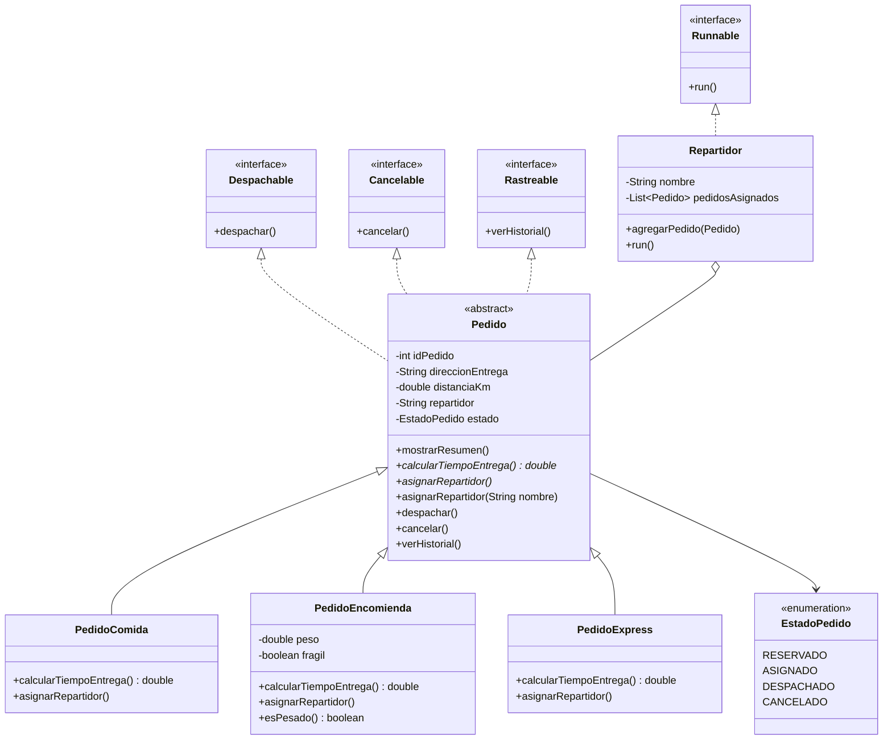

# Actividad Formativa – Semana 4
## Ejecutando tareas en paralelo con hilos en Java

### Proyecto: SpeedFast – Optimización de entregas

---

## Autor del proyecto

| Campo | Detalle |
|---|---|
| **Nombre completo** | Beatriz López Casanova |
| **Asignatura** | Desarrollo Orientado a Objetos II |
| **Carrera** | Analista Programador Computacional |
| **Sede** | Virtual |

---

## Descripción general del sistema

**SpeedFast** es una empresa de reparto a domicilio que gestiona comida, encomiendas y compras express. En las semanas anteriores se modelaron los pedidos con una clase abstracta, subclases e interfaces reutilizables.

Esta semana se incorpora **programación concurrente**. Cada repartidor funciona como un hilo independiente (`Runnable`) que recorre su lista de pedidos, simula la entrega con `Thread.sleep()` y informa el avance por consola. Los tres repartidores se ejecutan al mismo tiempo con `ExecutorService`.

| Tipo de pedido | Fórmula de tiempo |
|---|---|
| `PedidoComida` | 15 min + 2 min por cada km |
| `PedidoEncomienda` | 20 min + 1.5 min por km (redondeado a entero) |
| `PedidoExpress` | 10 min base; si distancia > 5 km, se agregan 5 min extra |

La distancia se valida entre **0.1 km** y **100 km**. Los errores se controlan con `try-catch` (`IllegalArgumentException`, `IllegalStateException` e `InterruptedException`).

---

## Estructura de paquetes y clases

```
semana4/src/main/java/org/speedFast/
├── interfaces/
│   ├── Despachable.java         → despachar()
│   ├── Cancelable.java          → cancelar()
│   └── Rastreable.java          → verHistorial()
├── model/
│   ├── Pedido.java              → Clase abstracta
│   ├── PedidoComida.java
│   ├── PedidoEncomienda.java
│   ├── PedidoExpress.java
│   └── Repartidor.java          → implements Runnable
├── util/
│   └── EstadoPedido.java        → RESERVADO, ASIGNADO, DESPACHADO, CANCELADO
└── app/
    └── Main.java                → ExecutorService
```

---

## Diagrama de clases



### Relaciones

| Relación | Tipo | Descripción |
|---|---|---|
| `Pedido` | **Clase abstracta** | Atributos comunes, `mostrarResumen()` y `calcularTiempoEntrega()` |
| Subclases → `Pedido` | **Herencia** | Comida, encomienda y express reutilizan el modelo |
| `Despachable`, `Cancelable`, `Rastreable` | **Interfaces propias** | Se crean en el proyecto (negocio SpeedFast) |
| `Runnable` | **Interfaz de Java** | `java.lang.Runnable`; no se declara en el proyecto |
| `Repartidor` | **Hilo** | Implementa `Runnable`; `run()` entrega los pedidos en secuencia |
| `Thread.sleep()` | **Pausa** | Simula el viaje con un tiempo aleatorio (1 a 3 segundos) |
| `ExecutorService` | **Pool de hilos** | En `Main` lanza los 3 repartidores en paralelo |

---

## Cómo contribuye el diseño a la calidad del software

- **Escalabilidad:** un nuevo repartidor es otra instancia de `Repartidor`; el pool puede crecer sin cambiar `run()`.
- **Reutilización:** se mantienen `Pedido`, las subclases y las interfaces de las semanas anteriores.
- **Mantenibilidad:** `Runnable` y `ExecutorService` separan “qué hace el repartidor” de “cómo se lanzan los hilos”. El cierre se hace con `shutdown()` y `awaitTermination`.

---

## Instrucciones para ejecutar el programa

### Requisitos previos

- Java JDK 17 o superior (el proyecto fue compilado y probado con JDK 26)
- Maven 3.x (o abrir directamente en IntelliJ IDEA)

### Opción A – Desde IntelliJ IDEA (recomendada)

1. Abrir el proyecto como proyecto Maven en IntelliJ IDEA.
2. Navegar a `semana4/src/main/java/org/speedFast/app/Main.java`.
3. Hacer clic derecho → **Run 'Main.main()'**.

### Opción B – Desde terminal con Maven

```bash
cd semana4
mvn compile
mvn exec:java -Dexec.mainClass="org.speedFast.app.Main"
```

### Opción C – Desde terminal (sin Maven)

```bash
cd semana4
mkdir -p out
javac -encoding UTF-8 -d out $(find src/main/java -name "*.java")
java -cp out org.speedFast.app.Main
```

---

## Salida esperada por consola

Primero se cancela el `PedidoExpress` #107 (`EstadoPedido.CANCELADO`).
Después corren los tres hilos a la vez, así que los mensajes de entrega se intercalan.

```
Cancelando PedidoExpress #107...
Estado actual: CANCELADO

[Repartidor: Camila] Entregando PedidoComida #101...
[Repartidor: Luis] Entregando PedidoExpress #102...
[Repartidor: Daniela] Entregando PedidoExpress #105...
[Repartidor: Camila] Pedido #101 entregado.
[Repartidor: Luis] Pedido #102 entregado.
[Repartidor: Camila] Entregando PedidoEncomienda #103...
[Repartidor: Luis] Entregando PedidoComida #104...
[Repartidor: Daniela] Pedido #105 entregado.
[Repartidor: Luis] Pedido #104 entregado.
[Repartidor: Luis] Pedido #107 cancelado. No se entrega.
[Repartidor: Camila] Pedido #103 entregado.
[Repartidor: Daniela] Entregando PedidoEncomienda #106...
[Repartidor: Daniela] Pedido #106 entregado.
[Main] Sistema finalizado.
```

El orden de las líneas entre repartidores puede cambiar en cada ejecución (hilos en paralelo).
Lo que no cambia: cada repartidor entrega **sus** pedidos en orden, y Luis **no entrega** el #107 porque `run()` revisa `EstadoPedido.CANCELADO`.

| Repartidor | Pedidos asignados |
|---|---|
| Camila | `PedidoComida` #101 y `PedidoEncomienda` #103 |
| Luis | `PedidoExpress` #102, `PedidoComida` #104 y `PedidoExpress` #107 (**cancelado**) |
| Daniela | `PedidoExpress` #105 y `PedidoEncomienda` #106 |

---

## Buenas prácticas aplicadas

- Reutilización de la clase abstracta `Pedido` y de las interfaces `Despachable`, `Cancelable` y `Rastreable`.
- `Repartidor` implementa `Runnable` y entrega los pedidos de forma secuencial en `run()`.
- Si el pedido está en `EstadoPedido.CANCELADO`, no se entrega.
- Simulación de entrega con `Thread.sleep()` y valores aleatorios.
- Ejecución en paralelo con `ExecutorService` (`newFixedThreadPool(3)` y `execute`).
- Cierre controlado: `shutdown()`, `awaitTermination` y `shutdownNow()` si un hilo no termina.
- Manejo de `InterruptedException`, `IllegalArgumentException` e `IllegalStateException`.
- Separación de responsabilidades en paquetes `interfaces`, `model`, `util` y `app`.

---

**Repositorio GitHub:** https://github.com/Be-ri-lo/SpeedFast-Poliformismo

**Fecha de entrega:** Semana 4 – Septiembre 2026

© Duoc UC | Escuela de Informática y Telecomunicaciones
